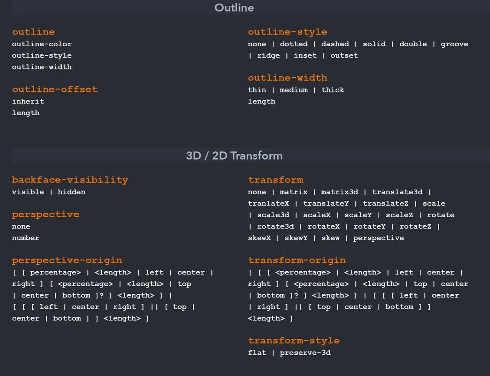

# what is css?

- CSS stands for Cascading Style Sheets
- Not Programming Language
- Used for Styling
- Design purpose
- External stylesheets are stored in CSS files
- Continuation of HTML

# why use CSS?

- styling
- layout & Design
- Animation
- Font changes
- organization
- flex-box
- grid system

# Types Of Styles

1. Inline-Adding style in each line
2. Internal-style tags
3. External-Linking external CSS file


## CSS Syntex:

selecter {property:value}


# CSS RoadMap


## CSS Basic

1.Box model --->content,padding,border,margin

2.Selecter and,Combinators

3.border,margin,padding,and outline

4.border-radius

5.background

6.colors -->simple,gradient,alpha transpency

6.Text -->

7.fonts

7.Icons

8.display -->block,inline,inline-block,etc..

9.position -->static,relative,absoulate,fixed,sticky

10.dimenation -->top,left,height,width,max-width,aspect-ratio etc..

12.overflow --> visible,hidden,scroll,auto

13.z-index -->-1,1,2,3

---

**1.Box model**

Content - The content of the box, where text and images appear.  


Padding - Clears an area around the content. The padding is transparent.


Border - A border that goes around the padding and content.


Margin - Clears an area outside the border. The margin is transparent.

---

**2.Selecter & combinater**

simple selecter ==>p{} , .class{} , #id{} , *{} , h1,p,h2{},

***combinators***

Descendant Selector(space):

div p{all div tag inside elements p} 

Child Selecter(>):

 div>p{The child selector selects all elements}
 
Adjacent Sibiling Selecter(+):

 div + p{div block outside first element working}

General Sibiling Selecter(~):

 div ~ p{div block outside all p element working}

 ***Attribute selecter***
  
  *CSS [attribute] Selector*:

  [title] {
  color: blue;
  }

  abbr[title] {
  color: red;
  }

  input[type="submit"] {
  border: 1px solid green;
  }

  [class~="warning"] {
  color: #fff;
  background: red;
  }

  [lang|=en] {
  color: #fff;
  background: blue;
  }

  a[href^="http://"] {
  background: url("external.png") 100% 50% no-repeat;
  padding-right: 15px;
  }

  a[href$=".pdf"] {
  background: url("pdf.png") 0 50% no-repeat;
  padding-left: 20px;
  }

  [class*="warning"] {
  color: #fff;
  background: red;
  } #\*= operator to make an attribute selector matches all elements


**3.border,margin,padding,and outline**

border-style:;
border-width:;
border-color:;
border-left:;

margin-top:;
margin-right:;
margin-bottom:;
margin-left:;

padding-top:;
padding-right:;
padding-bottom:;
padding-left:;

outline-style:;
outline-color:;
outline-width:;
outline-offset:;
outline:;

**4.border-radius**

border-radius:;

**5.bacground**

background-color:;

background-image:;

background-repeat:;

background-attachment:;

background-position:;

background (shorthand property):;

**6.colors**

color:;,RGB(0,0,0);,Hex,hsl

**6.Text**

*text alignment*

text-align:;
text-align-last:;
direction:;
unicode-bidi:;
vertical-align:;

*text Decoration*

text-decoration-line:;
text-decoration-color:;
text-decoration-style:;
text-decoration-thickness:;
text-decoration:;

*text transform*

text-transform:;

*text spacing*

text-indent:;
letter-spacing:;
line-height:;
word-spacing:;
white-space:;

*text shadow*

text-shadow:;

**7.fonts**
 
 font-family:;

 font-style:;

 font-size;

 font-weight:;

 font-variant:;

**7.Icons**
```
<script src="https://kit.fontawesome.com/yourcode.js" crossorigin="anonymous"></script>

<i class="fas fa-cloud"></i>

<i class="fas fa-heart"></i>
```

**8.display**

display:;#inline,block,none,inline-block

visibility:;#hidden

**9.position**

position:;#static,relative,fixed,absolute,sticky

**10.dimenation**

height:;#px not response,% is res in height,width

width:;

min-height:;

max-height:;

**11.float**

float:;#left,right,none,inherit

clear:;

**12.overflow**

overflow:;#visible,hidden,scroll,auto

**13.z-index**

The z-index property specifies the stack order of an element.

z-index:;#-1,1,2,..

**14.Counters**

- counter-reset - Creates or resets a counter

- counter-increment - Increments a counter value

- content - Inserts generated content

- counter() or counters() function - Adds the value of a counter to an element

**CSS Medium**

1.Specificity

2.pseudo classes,elements

3.opacity

4.filter

5.clip-path

6.mask

7.transform

8.media

9.flexbox

10.grid

11.animation


**1.Specificity**

  - Inline styles - Example: `<h1 style="color: pink;"></h1>`
  
  - Header style - Example: <style>*{color:"red"};</style>
  
  - external style - Example:`<link rel="stylesheet" href=style.css>`
  
  - ID  - Example: #idName
  
  - Classes, pseudo-classes, attribute selectors - Example: .test, :hover, [href]
  
  - Elements and pseudo-elements - Example: h1, :before


***first runnuning is inline css next id and next class and next tag:***

  .test {color: green;}

  p {color: red;}

  <p id="demo" class="test" style="color: pink;">Hello World!</p>

 .test {color: green;}

  p {color: red;}

  <p class="test">Hello World!</p>//output is:green color

 #demo {color: blue;}

    .test {color: green;}

    p {color: red;}

    <p id="demo" class="test">Hello World!</p>//output:blue color is running first


**2.pseudo classes, elements**

*Pseudo Class:*

`
syntex:
        selector:pseudo-class {
                         property: value;
                            }
                            `
  - Anchor Pseudo-classes --->  a:link{},a:visited{},a:hover{},a:active{}

  - Pseudo-classes and HTML Classes  --->  a.classname:hover {}

  - Hover on <div> ---> div:hover{}

  - CSS - The :first-child Pseudo-class ---> p:first-child{}


*Pesudo-Elemet:*

`
syntex:
      selector::pseudo-element {
                                property: value;
                              }
`
  - The ::first-line Pseudo-element ---> p::first-line {}
  
  - The ::first-letter Pseudo-element ---> p::first-letter {}
  
  - Pseudo-elements and HTML Classes ---> p.intro::first-letter {}
  
  - CSS - The ::before Pseudo-element ---> h1::before {}
  
  - CSS - The ::after Pseudo-element ---> h1::after {}
  
  - CSS - The ::marker Pseudo-element ---> ::marker {}
  
  - CSS - The ::selection Pseudo-element ---> ::selection {}


**3.opacity**

img {
  opacity: 0.5;
}

**4.filter**

filter: none | blur() | brightness() | contrast() | drop-shadow() | grayscale() | hue-rotate() | invert() | opacity() | saturate() | sepia() | url();


filter:;#drop-shadow(8px 8px 10px gray);,none;,blur(5px),brightness(200%);, grayscale(100%);,etc...


**5.Clip path**

clip: clip-source|basic-shape|margin-box|border-box|padding-box|content-box|fill-box|stroke-box|view-box|none|initial|inherit;

clip:;

**6.Mask**

mask-image:; = Specifies an image to be used as a mask layer for an element

mask-mode:;	Specifies whether the mask layer image is treated as a luminance mask or as an alpha mask

mask-origin:;	Specifies the origin position (the mask position area) of a mask layer image

mask-position:;	Sets the starting position of a mask layer image (relative to the mask position area)

mask-repeat:;	Specifies how the mask layer image is repeated

mask-size:;	Specifies the size of a mask layer image

**7.transform**
syntex:

transform: none|transform-functions|initial|inherit;

properties:

transform:;none,rotate(10deg);, rotateX(45deg);, rotateY(45deg);, skew(20deg,20deg);, skewX(30deg);,translate(20px,10px);,scale(2,2);matrix(0.866,0.7,-0.8,0.866,0,0);,


**8.media**

CSS Syntax
`
@media not|only mediatype and (mediafeature and|or|not mediafeature) {
  CSS-Code;
}`


**9.Flex Box Layout**

display:flex;

flex-direction:;

flex-wrap:;

flex-flow:;

justify-content:;

align-items:;

align-content:;


*The flex item properties are:*

order:;

flex-grow:;

flex-shrink:;

flex-basis:;

flex:;

align-self:;

**10.Grid Layout**

display: grid;

display: inline-grid;

column-gap:;

row-gap:;

gap:;


*Property	Description*

column-gap:;

gap:;

grid:;

grid-auto-rows, grid-auto-columns, and the grid-auto-flow properties

grid-area:;

grid-auto-columns:;

grid-auto-flow	:;

grid-auto-rows:;

grid-column	:;

grid-column-end

grid-column-gap

grid-column-start

grid-gap

grid-row

grid-row-end

grid-row-gap

grid-row-start

grid-template

grid-template-areas

grid-template-columns

grid-template-rows

row-gap

**10.CSS Animations**

@keyframes

animation-name

animation-duration

animation-delay

animation-iteration-count

animation-direction

animation-timing-function

animation-fill-mode

animation

**CSS Advanced**

1.Rounded Corner #border radius round corner

2.Border-Image # border image set

3.CSS Multiple Background #multiple bg-image set

4.CSS Gradients #gradient is a multiple color background

5.CSS Shadow #text and box shadows

**1.Rounded-corner**

border-radius:;

border-top-left-radius:;

border-top-right-radius:;

border-bottom-right-radius:;

border-bottom-left-radius:;

**2.Border-image**

border-image:;

border-image-source:;
 
order-image-slice:;
  
border-image-width:;
   
border-image-outset:;
    
border-image-repeat:;


**3.CSS Multiple Background**
`
#example1 {
  background-image: url(img_flwr.gif), url(paper.gif);
  background-position: right bottom, left top;
  background-repeat: no-repeat, repeat;
}`

#CSS Background Size:

background-size:;#contain and cover,and height,width

background-origin:;#border-box,padding-box,content-box

background-clip:;#border-box,padding-box,content-box

**4.CSS Gradients**

- Linear Gradients (goes down/up/left/right/diagonally)
`example:
        #grad {
  background-image: linear-gradient(red, yellow);
}
`

- Radial Gradients (defined by their center)
`examle:
#grad {
  background-image: radial-gradient(red, yellow, green);
}`


- Conic Gradients (rotated around a center point)
`
example:
  #grad {
  background-image: conic-gradient(red, yellow, green);
}

`

**5.CSS Shadow**

*text shadow*
  
  ```
  h1 {
      text-shadow: 2px 2px 5px red;
      }
```
*box-shadow*

```
div.card {
  width: 250px;
  box-shadow: 0 4px 8px 0 rgba(0, 0, 0, 0.2), 0 6px 20px 0 rgba(0, 0, 0, 0.19);
  text-align: center;
}
```

# css Selecter

- Element or Tag Selector
  h1{},p{},h2{}

- Id Selector
  #idname{}

- Class Selector
  .classname{}

- Universal Selector
  \*{

  }

- CSS Grouping Selector
  h1,h2,h3{}

- Attribute Selector
  input[type="text"]{}

#CSS Combinators selecter

- Descendant Selector
  ul li{}

- Adjacent Sibling Selectors
  h1+p{}

- Child Selector
  div>p{}

- General Sibling Selectors
  h1~p{}

  #Anchor Pseudo-classes

  - a:link{}
  - a:visited{}
  - a:hover{}
  - a:active{}

- firstchild pesudoclass
  ol li:first-child{}

- lastchild
  ul li:last-child {
  border-right: none;
  }

- The :nth-child Pseudo-class
  table tr:nth-child(2n) td {
  background: #eee;
  }

#Pseudo-Elements

- The ::first-line Pseudo-element
  p::first-line {
  color: #ff0000;
  font-variant: small-caps;
  }

- The ::first-letter Pseudo-element

p::first-letter {
color: #ff0000;
font-size: xx-large;
}

- The ::before and ::after Pseudo-element
  h1::before {
  content: url("images/marker-left.gif");
  }
  h1::after {
  content: url("images/marker-right.gif");
  }

 


# css cheetsheet





# css basic


