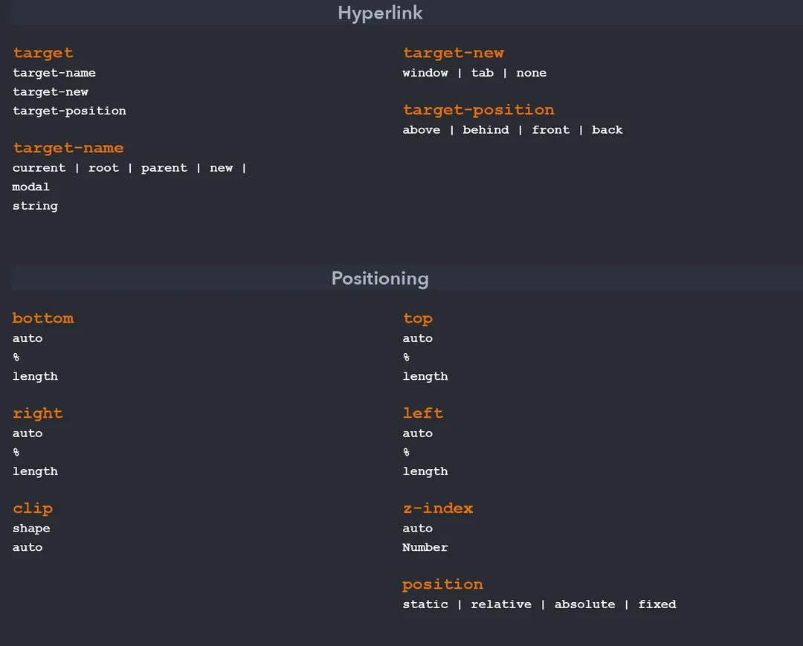

# what is css?

- CSS stands for Cascading Style Sheets
- Not Programming Language
- Used for Styling
- Design purpose
- External stylesheets are stored in CSS files
- Continuation of HTML

# why use CSS?

- styling
- layout & Design
- Animation
- Font changes
- organization
- flex-box
- grid system

# Types Of Styles

1. Inline-Adding style in each line
2. Internal-style tags
3. External-Linking external CSS file


## CSS Syntex:

selecter {property:value}


### CSS RoadMap


* CSS Basic *

1.Box model --->content,padding,border,margin
2.Selecter and,Combinators
3.border,margin,padding,and outline
4.border-radius
5.background
6.colors -->simple,gradient,alpha transpency
6.Text -->
7.fonts
7.Icons
8.display -->block,inline,inline-block,etc..
9.position -->static,relative,absoulate,fixed,sticky
10.dimenation -->top,left,height,width,max-width,aspect-ratio etc..
11.Float -->none,left,right,inline-start,inline-end,inherit
12.overflow --> visible,hidden,scroll,auto
13.z-index -->-1,1,2,3

<--1.Box model-->

Content - The content of the box, where text and images appear
Padding - Clears an area around the content. The padding is transparent
Border - A border that goes around the padding and content
Margin - Clears an area outside the border. The margin is transparent

<--2.Selecter combinater-->

simple selecter ==>p{} , .class{} , #id{} , *{} , h1,p,h2{},
combinators ==>div p{all div tag inside elements p} , div>p{The child selector selects all elements},div + p{div block outside first element working},div ~ p{div block outside all p element working}

<---3.border,margin,padding,and outline--->

border-style:;
border-width:;
border-color:;
border-left:;

margin-top:;
margin-right:;
margin-bottom:;
margin-left:;

padding-top:;
padding-right:;
padding-bottom:;
padding-left:;

outline-style:;
outline-color:;
outline-width:;
outline-offset:;
outline:;

<---4.border-radius--->

border-radius:;

<---5.bacground--->

background-color:;
background-image:;
background-repeat:;
background-attachment:;
background-position:;
background (shorthand property):;

<---6.colors--->

color:;,RGB(0,0,0);,Hex,hsl

<--6.Text--->

*text alignment*

text-align:;
text-align-last:;
direction:;
unicode-bidi:;
vertical-align:;

*text Decoration*

text-decoration-line:;
text-decoration-color:;
text-decoration-style:;
text-decoration-thickness:;
text-decoration:;

*text transform*

text-transform:;

*text spacing*

text-indent:;
letter-spacing:;
line-height:;
word-spacing:;
white-space:;

*text shadow*

text-shadow:;

<---7.fonts--->
 
 font-family:;
 font-style:;
 font-size;
 font-weight:;
 font-variant:;

<--7.Icons--->

<script src="https://kit.fontawesome.com/yourcode.js" crossorigin="anonymous"></script>
<i class="fas fa-cloud"></i>
<i class="fas fa-heart"></i>

<---8.display--->

display:;
visibility:;

<---9.position--->

position:;#static,relative,fixed,absolute,sticky

<---10.dimenation--->

height:;#px not response,% is res in height,width
width:;
min-height:;
max-height:;

<---11.float--->

float:;#left,right,none,inherit
clear:;

<---12.overflow--->

overflow:;#visible,hidden,scroll,auto

<---13.z-index--->

The z-index property specifies the stack order of an element.
z-index:;


*CSS Medium *

1.Specificity
2.pseudo classes,elements
3.opacity
4.filter
5.clip-path
6.mask
7.transform
8.media
9.flexbox
10.grid
11.animation


<---1.Specificity--->

* Inline styles - Example: <h1 style="color: pink;">
* Header style - Example: <style>*{color:"red"};
* external style - Example:<link rel="stylesheet" href=style.css>
* ID  - Example: #navbar
* Classes, pseudo-classes, attribute selectors - Example: .test, :hover, [href]
* Elements and pseudo-elements - Example: h1, :before


**first runnuning is inline css next id and next class and next tag

  .test {color: green;}
  p {color: red;}
  <p id="demo" class="test" style="color: pink;">Hello World!</p>

 .test {color: green;}
  p {color: red;}
  <p class="test">Hello World!</p>//output is:green color

 #demo {color: blue;}
    .test {color: green;}
    p {color: red;}
    <p id="demo" class="test">Hello World!</p>//output:blue color is running first


<---2.pseudo classes, elements--->

**Pseudo Class:

syntex:
        selector:pseudo-class {
                         property: value;
                            }
* Anchor Pseudo-classes --->  a:link{},a:visited{},a:hover{},a:active{}
* Pseudo-classes and HTML Classes  --->  a.classname:hover {}
* Hover on <div> ---> div:hover{}
* CSS - The :first-child Pseudo-class ---> p:first-child{}

**Pesudo-Elemet:

syntex:
      selector::pseudo-element {
                                property: value;
                              }

* The ::first-line Pseudo-element ---> p::first-line {}
* The ::first-letter Pseudo-element ---> p::first-letter {}
* Pseudo-elements and HTML Classes ---> p.intro::first-letter {}
* CSS - The ::before Pseudo-element ---> h1::before {}
* CSS - The ::after Pseudo-element ---> h1::after {}
* CSS - The ::marker Pseudo-element ---> ::marker {}
* CSS - The ::selection Pseudo-element ---> ::selection {}


<---3.opacity--->

img {
  opacity: 0.5;
}

<---4.filter--->

filter: none | blur() | brightness() | contrast() | drop-shadow() | grayscale() | hue-rotate() | invert() | opacity() | saturate() | sepia() | url();


filter:;#drop-shadow(8px 8px 10px gray);,none;,blur(5px),brightness(200%);, grayscale(100%);,etc...


<--5.Clip path--->

clip: clip-source|basic-shape|margin-box|border-box|padding-box|content-box|fill-box|stroke-box|view-box|none|initial|inherit;

clip:;

<---6.Mask--->

mask-image:; = Specifies an image to be used as a mask layer for an element
mask-mode:;	Specifies whether the mask layer image is treated as a luminance mask or as an alpha mask
mask-origin:;	Specifies the origin position (the mask position area) of a mask layer image
mask-position:;	Sets the starting position of a mask layer image (relative to the mask position area)
mask-repeat:;	Specifies how the mask layer image is repeated
mask-size:;	Specifies the size of a mask layer image

<---7.transform--->

syntex:
transform: none|transform-functions|initial|inherit;

properties:

transform:;none,rotate(10deg);, rotateX(45deg);, rotateY(45deg);, skew(20deg,20deg);, skewX(30deg);,translate(20px,10px);,scale(2,2);matrix(0.866,0.7,-0.8,0.866,0,0);,


<---8.media--->

CSS Syntax

@media not|only mediatype and (mediafeature and|or|not mediafeature) {
  CSS-Code;
}


<---9.Flex Box Layout--->

display:flex;
flex-direction:;
flex-wrap:;
flex-flow:;
justify-content:;
align-items:;
align-content:;

The flex item properties are:

order:;
flex-grow:;
flex-shrink:;
flex-basis:;
flex:;
align-self:;

<---10.Grid Layout--->

display: grid;
 display: inline-grid;

 column-gap:;
row-gap:;
gap:;


Property	Description
column-gap:;
gap:;
grid:;
grid-auto-rows, grid-auto-columns, and the grid-auto-flow properties
grid-area:;
grid-auto-columns:;
grid-auto-flow	:;
grid-auto-rows:;
grid-column	:;
grid-column-end
grid-column-gap
grid-column-start
grid-gap
grid-row
grid-row-end
grid-row-gap
grid-row-start
grid-template
grid-template-areas
grid-template-columns
grid-template-rows
row-gap

<---10.CSS Animations--->

@keyframes
animation-name
animation-duration
animation-delay
animation-iteration-count
animation-direction
animation-timing-function
animation-fill-mode
animation


# css Selecter

- Element or Tag Selector
  h1{},p{},h2{}

- Id Selector
  #idname{}

- Class Selector
  .classname{}

- Universal Selector
  \*{

  }

- CSS Grouping Selector
  h1,h2,h3{}

- Attribute Selector
  input[type="text"]{}

#CSS Combinators selecter

- Descendant Selector
  ul li{}

- Adjacent Sibling Selectors
  h1+p{}

- Child Selector
  div>p{}

- General Sibling Selectors
  h1~p{}

  #Anchor Pseudo-classes

  - a:link{}
  - a:visited{}
  - a:hover{}
  - a:active{}

- firstchild pesudoclass
  ol li:first-child{}

- lastchild
  ul li:last-child {
  border-right: none;
  }

- The :nth-child Pseudo-class
  table tr:nth-child(2n) td {
  background: #eee;
  }

#Pseudo-Elements

- The ::first-line Pseudo-element
  p::first-line {
  color: #ff0000;
  font-variant: small-caps;
  }

- The ::first-letter Pseudo-element

p::first-letter {
color: #ff0000;
font-size: xx-large;
}

- The ::before and ::after Pseudo-element
  h1::before {
  content: url("images/marker-left.gif");
  }
  h1::after {
  content: url("images/marker-right.gif");
  }

  #CSS [attribute] Selector

  [title] {
  color: blue;
  }

  abbr[title] {
  color: red;
  }

  input[type="submit"] {
  border: 1px solid green;
  }

  [class~="warning"] {
  color: #fff;
  background: red;
  }

  [lang|=en] {
  color: #fff;
  background: blue;
  }

  a[href^="http://"] {
  background: url("external.png") 100% 50% no-repeat;
  padding-right: 15px;
  }

  a[href$=".pdf"] {
  background: url("pdf.png") 0 50% no-repeat;
  padding-left: 20px;
  }

  [class*="warning"] {
  color: #fff;
  background: red;
  } #\*= operator to make an attribute selector matches all elements

# command

```bash
***CSS comments***

/**/#is a multi line command
//#is a single line command


***CSS Background Color***
#RGB,HEX,HSL is a color format

background-color:Tomato;#bg-color is tomato

***CSS Text Color***

color:red;#font-color is red


***CSS Border****

border:2px;#border is a line

***RGB Value RED,GREEN,BLUE***

color:rgb(255, 0, 0);#redcolor is rgb value

***RGBA Value RED,GREEN,BLUE,ALBHA***

color:rgba(255, 99, 71, 0.8);

***HEX Vale***

background-color:#ff0000;

***HSL***

background-color:hsl(0, 100%, 50%);

***CSS Background***

background-color:red;#rgb,rgba,hsl colors
opacity:0.5;#light color
background-image:url();#image bg
background-repeat:repeat; no-repeat,repeat-x,space,initialinherit
background-attachment:fixed; scroll
background-position:; left top,left center,left bottom,right top,right center,right bottom,center top,center center,center bottom

background (shorthand property): background: #ffffff url("img_tree.png") no-repeat right top;


***CSS Border***

border-style:;
dotted - Defines a dotted border
dashed - Defines a dashed border
solid - Defines a solid border
double - Defines a double border
groove - Defines a 3D grooved border. The effect depends on the border-color value
ridge - Defines a 3D ridged border. The effect depends on the border-color value
inset - Defines a 3D inset border. The effect depends on the border-color value
outset - Defines a 3D outset border. The effect depends on the border-color value
none - Defines no border
hidden - Defines a hidden border

border-width:;#n px, pt, cm, em, etc
border-color:;#border color
border: 5px solid red;#width,syle,color
border-radius:;#px,cm,em


***CSS Margin***

margin-top:;
margin-right:;
margin-bottom:;
margin-left:;
margin:;

***CSS Padding***

padding-top:;
padding-right:;
padding-bottom:;
padding-left:;
padding:;

***CSS Height Width***

height:;,auto,length,%,initial,inherit
width:;
max-height:;
min-height:;
max-width:;
min-width:;


***OUTline***

outline-style:;dotted,etc...
outline-color:;#outline color
outline-width:;thin,medium,thick,px,em
outline-offset: 15px;
outline:;
outline: 5px solid yellow;

***Text color***

color:;
text-align:;
text-align-last:;
direction:rtl;
unicode-bidi:bidi-override;
vertical-align:;baseline,text-top,text-bottom,sub,super
text-decoration-line:;
text-decoration-color:;
text-decoration-style:;
text-decoration-thickness:;
text-decoration:;
text-transform:;
text-indent:;
letter-spacing:;
line-height:;
word-spacing:;
white-space:;
text-shadow:;


***Font***

font-family:;
font-style :;
font-weight:;
font-variant:;
font-size:;
 font: 20px Arial, sans-serif;


border: 2px solid;#border
outline: 2px solid;#borderoutline
background-size:;#auto, contain, and cover
background-color:;#background-color
background-image: url("images/tile.png");#bg-img
background-repeat:;#repeat,repeat-x,repeat-y,no-repeat
background-attachment:;#fixed,
background-clip:;#border-box, padding-box, content-box
background-position:;#left top,top,right,left,center,righttop
background-origin:;# border-box, padding-box, content-box.
text-align: center;#text alignment
font-size: 18px;#fontsize

font-family:;#serif, sans-serif,
font-style:;#normal, italic or oblique
font-weight:;#normal, bold, bolder, lighter, 100, 200, 300, 400, 500, 600, 700, 800, 900 and inherit.
font-size:56px;#sizefont
font-variant:;# capital letters, in which lowercase letters
text-transform: uppercase;#textchaned
*#all element
#->#id element
. #class select
text-decoration: none;#text underline none
text-overflow :;# clip and ellipsis and string.
text-align:;# left, right, centre or justified
text-decoration:;# underline, overline, line-through, and none
text-transform:;#uppercase or lowercase letters, or capitalize
text-indent:;#percentage (%), length values in pixels, ems, etc.
line-height:;#percentage (%), length values in pixels, ems, etc.
letter-spacing:;#percentage (%), length values in pixels, ems, etc.
word-spacing:;#percentage (%), length values in pixels, ems, etc.
box-shadow: offset-x offset-y blur-radius color;
a:link #define styles for normal or unvisited links.
a:visited #define styles for links that the user has already visited.
a:hover # define styles for a link when the user place the mouse pointer over it.
a:active #define styles for links when they are being clicked.

list-style-type:;#letters, circle, square,
list-style-position:;# inside.outside
list-style-image:;#list img

border-style:;#none, hidden, solid, dashed, dotted, double, inset, outset, groove, and ridge
 border-width:;
 border-color:;
 border-radius:;
 border-img:;
 outline-style:;#border-outside line ,ex: none, solid, dashed, dotted, double, inset, outset, groove, and ridge
 outline-width:;
 outline-color:;
border-collapse:;#collapse
border-spacing: 10px;
height:;
width:;

Flexbox Container Properties

display:flex;
flex-direction: row | row-reverse | column | column-reverse;

flex-wrap:nowrao|wrap|wrap-reverse;
justify-contents:flex-star|center|flex-end|sapce-between|sapce-around;

align-items:flex-star|center|flex-end|sapce-between|sapce-around;

align-contents:flex-star|center|flex-end|sapce-between|sapce-around;

flex-grow: 1;
flex-wrap: wrap;
 flex-shrink: 1;

margin-top:;
margin-right:;
margin-bottom:;
margin-left:;
 vertical-align:;#

 tbody tr:nth-child(odd) {
    background-color: #f2f2f2;
}#odd no color change

overflow-x: auto;#table response

padding:;#padding-top,padding-right

width: 300px;
height: 200px;
padding: 15px; /* set padding for all four sides */
border: 10px solid black; /* set border for all four sides */
margin: 20px auto; /* set top and bottom margin to 20 pixels, and left and right margin to auto */

min-width: 300px;
max-width: 500px;
  opacity: 0.7;#image bg light

cursor:;#mouse to assign to chnge the cursor
cursor: 	[url(address of cursor file),]0 or more times | auto | default | none | context-menu | help | pointer | progress | wait | cell | crosshair | text | vertical-text | alias | copy | move | no-drop | not-allowed | grab | grabbing | e-resize | n-resize | ne-resize | nw-resize | s-resize | se-resize | sw-resize | w-resize | ew-resize | ns-resize | nesw-resize | nwse-resize | col-resize | row-resize | all-scroll | zoom-in | zoom-out | initial | inherit


overflow-x and overflow-y :;#visible (default), hidden, scroll


display:;#block,inline,inline-block,none
position:;#top or bottom and/or left or right.absoluate,fixed,relative
z-index :;
float:;#left,right,none


 visibility :;#visible,hidden,collapse,inherit

linear-gradient(direction, color-stop1, color-stop2, ...)#Double colcor
linear-gradient(angle, color-stop1, color-stop2, ...)
radial-gradient(shape size at position, color-stop1, color-stop2, ...);
radial-gradient()#closest-side, farthest-side, closest-corner, farthest-corner.
```

# css cheetsheet





# css basic


